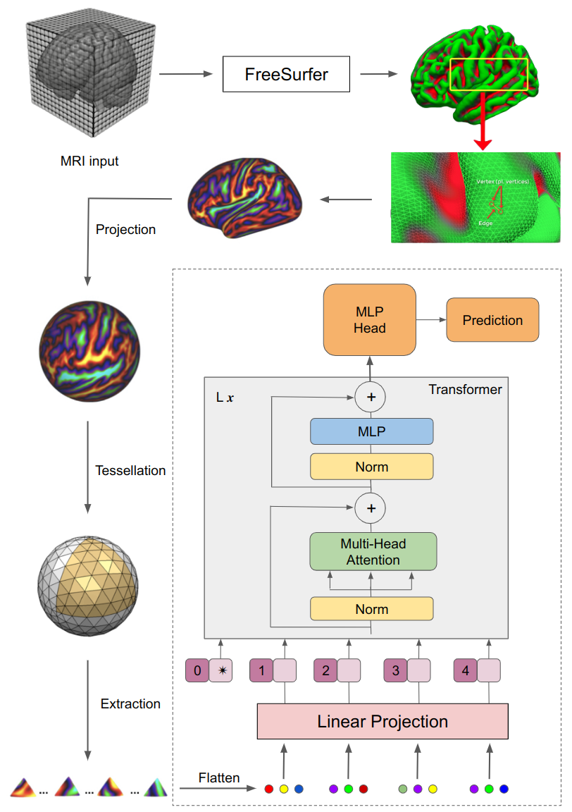

# TUM_AlzheimerPrediction

This repository contains the code accompanying a master thesis to apply vision transformers on surface data. Here we applied [Surface Vision Transformer](https://arxiv.org/abs/2203.16414) (SiT) on cortical data for the tasks of age prediction and Alzheimer's disease classification. The code is based on this [Github](https://github.com/metrics-lab/surface-vision-transformers). The architecture of the approach can be seen in the following image:




## Abstract
The analysis of cortical meshes from brain MRI scans is essential for the early diagnosis and treatment of many brain-related diseases, like Alzheimer's disease. Many techniques to classify different neurological degeneratives already exist, but usually a lot of domain knowledge and fine-tuned preprocessing steps are needed to get results for a specific disease. In this work, we try to address these issues by evaluating the transfer abilities of a promising method, called Surface Vision Transformer (SiT), that works on 3D MRI scans, requiring only standardized preprocessing by established components (FreeSurfer). SiT uses a projection onto the spherical manifold in combination with a vision transformer architecture to model long-range associations in the data and overcome the limitations of graph convolutions. We evaluate the performance of the method on three brain MRI datasets on the tasks of brain age prediction and Alzheimer's disease classification and show, that competitive results are possible in the regression setting. However, more work is needed to tackle the state of the art for the classification task.

## Content

- [TUM\_AlzheimerPrediction](#tum_alzheimerprediction)
  - [Abstract](#abstract)
  - [Content](#content)
  - [Installation](#installation)
  - [Data](#data)
  - [Logging](#logging)
  - [Project structure](#project-structure)
  - [References](#references)
  - [Citation](#citation)

## Installation

For PyTorch and dependencies installation, please follow instructions in [install.md](docs/install.md)

## Data

The data can be obtained from: [ADNI](https://adni.loni.usc.edu/data-samples/access-data/). After getting the data create a `.env` file with the path to the data as `BASE_DATA_FOLDER`. Furthermore, add the path, where the repo is checked out as `BASE_REPO_FOLDER`.

## Logging

For logging, we used `Weights&Biases`, because it allows to track the data, model and code plus providing visualizations. To run your experiments against your own account, add your user and project name in the `.env` file as `USER` and `PROJECT`.

## Project structure

Here, the overall folder structure is quickly explained.

```
.
└── project_root_folder
    ├── master_thesis.pdf   # Master thesis to read up on concepts and ideas    
    ├── architecture.png    # Overview of the architecture of the approach
    ├── .env                # file to store your environment variables
    ├── .gitignore          # Define which files git should ignore
    ├── requirements.txt    # The python dependencies
    ├── tasks               # folder containing single-run tasks, like data splitting or visualizations
    ├── logs                # folder containing all your logs, when you train the model (will be automatically created)
    ├── docs                # folder containing the install instructions and some additional literature
    ├── code                # folder containing the code
        ├── cv_utils        # folder containing the main code of this repo (model, datamodule)
        └── setup.py        # file to install the code as python library
```

The structure of the main code folder is shown in more detail.

```
├── cv_utils                # folder containing the main code of this repo (model, datamodule)
    ├── configs             # folder containing the config files for preprocessing, training, tuning and testing
    ├── data                # folder containing the data files created after preprocessing is run (will be automatically created)
    ├── labels              # folder containing the data splits for each prediction task (is created by the split_XXX.py scripts)
    ├── tools               # folder containing the files for training, testing and hyperparametertuning
    ├── utils               # folder containing the helper functions to preprocess or split the data
    └── callbacks.py        # file containing logging callbacks
    └── datamodule.py       # file containing the data loaders and modules
    └── metrics.py          # file containing all self created metrics
    └── models.py           # file containing the code for the model    
```

## References

This repository is based on the following repositories:
- [SiT](https://github.com/metrics-lab/surface-vision-transformers)
- [Explainable NLP](https://github.com/MoritzSchueler96/TUM_Praktikum_NLP_Explainability)

## Citation

Please cite this work if you found it useful:

```
@article{
    Schuler_Learning_on_Cortical_2023,
    author = {Schüler, Moritz},
    journal = {TUM - School of Computation, Information and Technology - Informatics},
    month = 6,
    title = {{Learning on Cortical Meshes with Surface Vision Transformers (SiT)}},
    year = {2023}
}
```
